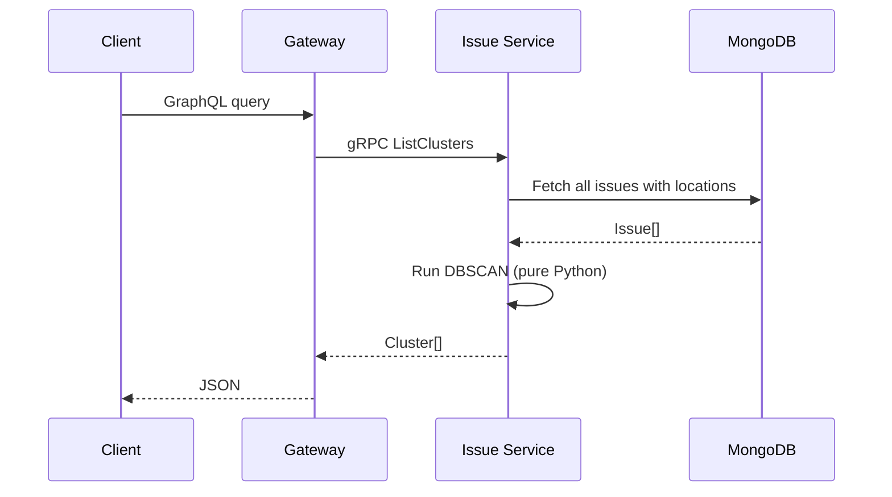
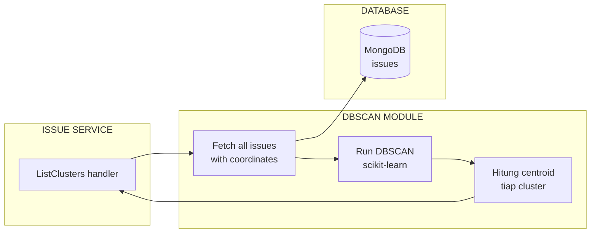

# Implementation

Clustering implementation in Issue Service via gRPC endpoint `ListClusters`.

## Proto

```protobuf
message Cluster {
  string address = 1;
  double lat = 2;
  double lon = 3;
  int32 issue_count = 4;
  repeated string types = 5;
}

message ListClustersRequest {}
message ListClustersResponse {
  repeated Cluster clusters = 1;
}

service IssueService {
  rpc ListClusters(ListClustersRequest) returns (ListClustersResponse);
}
```

## Current: Pure Python DBSCAN

The Issue Service now uses a **pure NumPy-free Python DBSCAN** implementation — no scikit-learn dependency needed.



### Config

| Env Var | Default | Description |
|---------|---------|-------------|
| `CLUSTER_EPS_KM` | `7.0` | Maximum distance (km) for neighborhood |
| `CLUSTER_MIN_PTS` | `3` | Minimum points to form a cluster |

### Code

```python
# features/clustering/dbscan.py

def haversine_km(lat1, lon1, lat2, lon2):
    """Haversine distance in km."""
    R = 6371.0
    dlat = math.radians(lat2 - lat1)
    dlon = math.radians(lon2 - lon1)
    a = (math.sin(dlat/2)**2 + math.cos(math.radians(lat1))
         * math.cos(math.radians(lat2)) * math.sin(dlon/2)**2)
    return R * 2 * math.atan2(math.sqrt(a), math.sqrt(1-a))

class DBSCAN:
    def __init__(self, eps_km=7.0, min_samples=3):
        self.eps_km = eps_km
        self.min_samples = min_samples

    def fit_predict(self, points):
        # Precompute distance matrix
        # Find neighbors within eps_km
        # Expand clusters from core points
        # Return labels (-1 = noise)
        ...
```

### Usage in Repository

```python
# lib/db.py
from features.clustering import cluster_issues, summarize_clusters

def list_clusters(self):
    all_issues = self.issues.find({"location": {"$ne": None}})
    labeled = cluster_issues(all_issues,
        eps_km=self.eps_km,
        min_samples=self.min_samples)
    return summarize_clusters(labeled)
```

## Future Enhancements



### Implementation Plan

1. **New module**: `features/clustering/dbscan.py`
2. **Parameters**: ε and MinPts via environment variable or request
3. **Output**: same `Cluster` proto — backward compatible
4. **Cache**: clustering result cached in Redis, invalidated on new issue creation

### Example Output

```json
{
  "clusters": [
    {
      "address": "Jakarta Pusat",
      "lat": -6.18, "lon": 106.83,
      "issue_count": 12,
      "types": ["garbage", "flood"]
    },
    {
      "address": "Bandung",
      "lat": -6.92, "lon": 107.61,
      "issue_count": 8,
      "types": ["vandalism", "fallen_tree"]
    }
  ]
}
```
