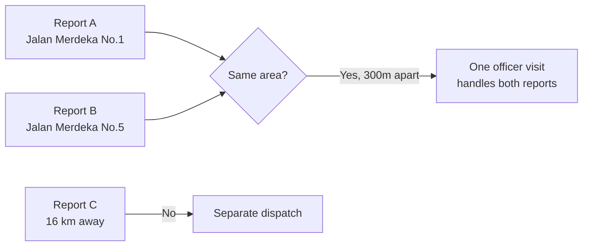
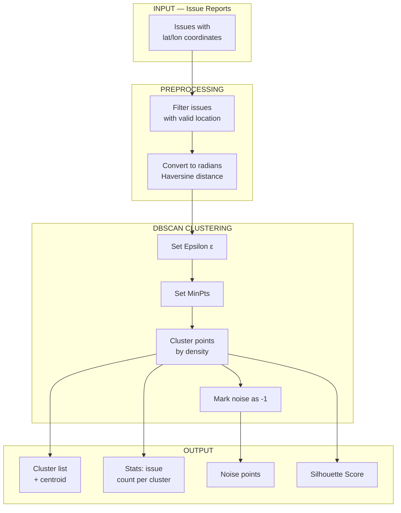

# Clustering

Grouping nearby environmental reports so officers can handle multiple reports in a single trip.

## Purpose

When citizens submit reports from the same area (e.g., same neighborhood or street), instead of dispatching separate officers for each report, clustering groups them together:



This way, one trip can resolve multiple issues in the same cluster.

## Data Source

Clustering data comes from **Twitter reports** ingested via the Twitter Service. There is no initial static dataset — results are generated from the accumulated reports in MongoDB:

```
Twitter API → Twitter Service → MongoDB (issues collection) → Clustering
```

As more tweets are ingested, the cluster distribution changes dynamically.

## Flow



## Stages

### 1. Input Data

Report data from MongoDB with `location` field:

```json
{
  "_id": "abc123",
  "type": "garbage",
  "location": { "lat": -6.2, "lon": 106.8, "address": "Jakarta" },
  "created_at": 1700000000
}
```

### 2. Preprocessing

- Filter issues with valid `location`
- Extract `(lat, lon)` as numpy array
- Convert to radians for **Haversine distance** calculation

### 3. DBSCAN

```python
from sklearn.cluster import DBSCAN
import numpy as np
from sklearn.metrics import silhouette_score

# Coordinates in radians
coords = np.radians([
    [issue["location"]["lat"], issue["location"]["lon"]]
    for issue in issues
])

# DBSCAN with Haversine
db = DBSCAN(eps=0.01, min_samples=3, metric="haversine")
labels = db.fit_predict(coords)

n_clusters = len(set(labels)) - (1 if -1 in labels else 0)
n_noise = list(labels).count(-1)
noise_pct = (n_noise / len(labels)) * 100

# Evaluation
if n_clusters > 1:
    score = silhouette_score(coords, labels, metric="haversine")
```

### 4. Output

- **Clusters**: report groups with centroid (center lat/lon)
- **Noise**: isolated points not belonging to any cluster
- **Silhouette Score**: cluster quality indicator

## Evaluation

| Metric | Range | Better |
|--------|-------|--------|
| **Silhouette Score** | -1 to 1 | Closer to 1 |
| **Noise Percentage** | 0%–100% | Lower is better |
| **Number of Clusters** | 0–N | Depends on data |
