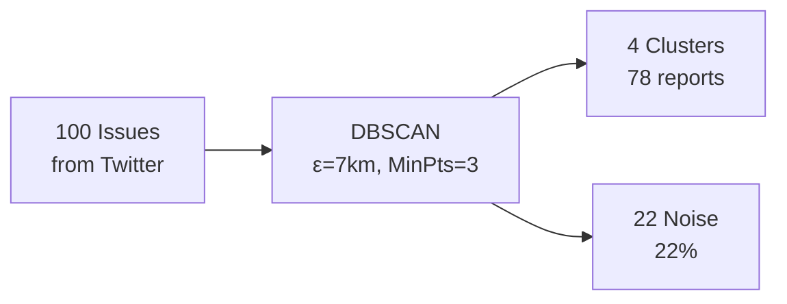
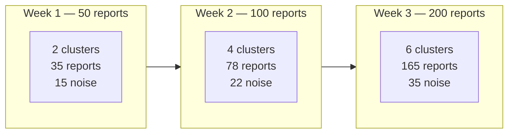

# Results

Clustering results are generated from **Twitter reports** accumulated in the database. Numbers below are examples based on a moderate clustering configuration (ε ≈ 7 km, MinPts = 3).

> **Note**: These are illustrative results. Actual numbers depend on how many tweets have been ingested.

## Data Source

Data comes from Twitter reports ingested via the Twitter Service:

There is **no initial dataset** — results grow organically as new reports come in.

## Example Configuration

| Parameter | Value | Reasoning |
|-----------|-------|-----------|
| **Epsilon (ε)** | ~7 km (0.006 rad) | Reports within 7 km radius → one officer trip |
| **MinPts** | 3 | At least 3 reports to form a cluster |
| **Metric** | Haversine | Geographic distance |

## Example Results (100 reports ingested)

### Cluster Details

| Cluster | Area | Reports | Types | Est. Radius |
|---------|------|---------|-------|-------------|
| C1 | Jakarta Pusat | 31 | garbage, flood | ~3 km |
| C2 | Jakarta Selatan | 24 | vandalism, garbage | ~4 km |
| C3 | Bandung | 14 | fallen_tree | ~5 km |
| C4 | Surabaya | 9 | road_damage, flood | ~6 km |
| Noise | Various | 22 | mixed | isolated |

### Interpretation

- **4 clusters** = 4 areas where an officer can handle multiple reports in one trip
- **22% noise** = isolated reports needing separate dispatch
- **78% clustered** = efficiency gain: ~80% of reports can be batched

## As More Data Comes In

As more tweets are ingested, clusters grow and new clusters may form:

## Moderate Clustering Approach

The goal is **moderate clustering** — not too many tiny clusters, not one giant cluster:

- If ε is too small (1 km) → too many clusters, defeats the purpose
- If ε is too large (50 km) → one giant cluster, officer still needs to travel far
- **Moderate (5–10 km)** → reports in the same neighborhood are grouped, officer can walk/drive short distance

| Approach | ε | Clusters | Officer Benefit |
|----------|---|----------|----------------|
| 🔴 Too tight | 1 km | Many small | Still need many trips |
| 🟢 **Moderate** | **~7 km** | **4–6** | **One trip per neighborhood** |
| 🔴 Too loose | 50 km | 1 giant | Officer must cross city |
