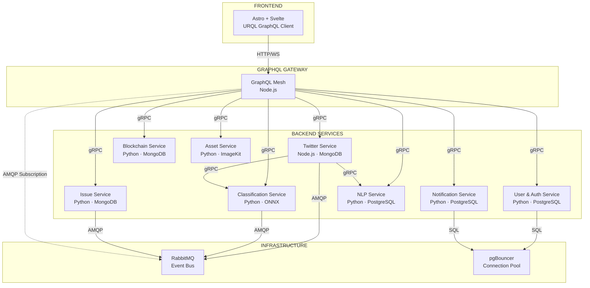
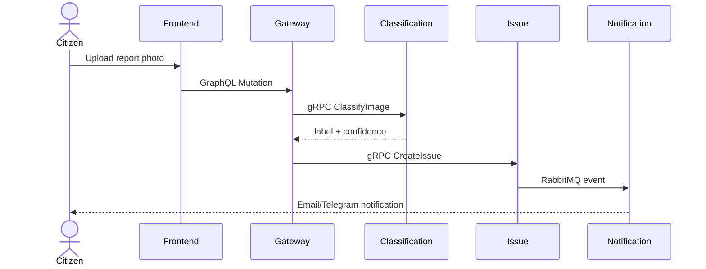
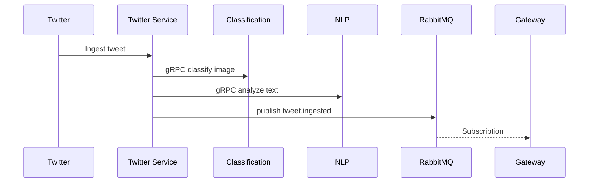
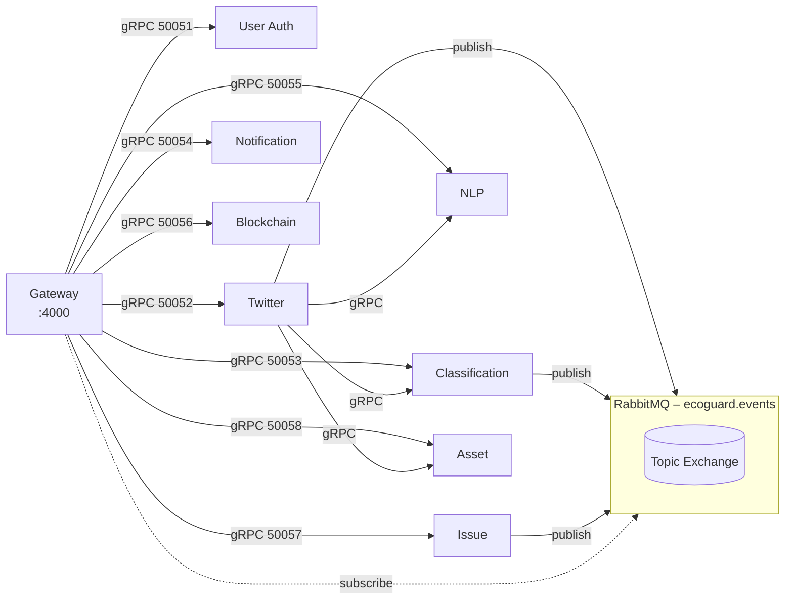

# Architecture

Ecoguard uses a **microservice architecture** with a **GraphQL Gateway** as the single entry point.

## Architecture Diagram



## Design Principles

### Service Isolation
- **One service, one responsibility** — no service handles more than one domain.
- **Each service has its own database** — no database sharing.
- **Sync** communication via **gRPC** (protobuf).
- **Async** communication via **RabbitMQ** (event bus).

### Gateway
- Gateway **has no business logic** — only translates GraphQL queries to gRPC calls.
- **JWT validation** is done at the gateway by calling `AuthService.ValidateToken`.
- Gateway supports **aggregation** — a single GraphQL query can fetch from multiple services.

### Feature-Driven Structure
Code is organized by **feature**, not by layer:

```
user-auth-service/
├── user/           # Feature: user CRUD
│   ├── models.py
│   ├── repository.py
│   └── service.py
├── auth/           # Feature: authentication
│   ├── jwt.py
│   ├── password.py
│   └── service.py
└── common/         # Shared utilities
```

## Data Flow

### Citizen Report Flow



### Twitter Ingestion Flow



## Service Communication Map



## Event Map

| Event | Publisher | Consumer | Routing Key |
|-------|-----------|----------|-------------|
| Tweet ingested | Twitter Service | Gateway (Subscription) | `tweet.ingested` |
| Classification completed | Classification Service | Notification Service | `classification.completed` |
| Issue created | Issue Service | Notification Service | `issue.created` |
