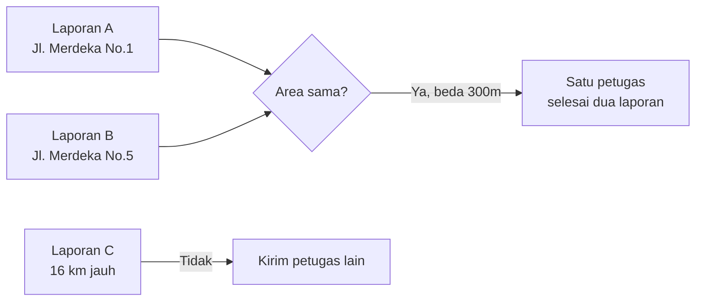

# Clustering

Mengelompokkan laporan berdekatan agar petugas bisa handle beberapa laporan dalam satu perjalanan.

## Tujuan



## Sumber Data

Data dari laporan Twitter yang masuk via Twitter Service. Tidak ada dataset awal — hasil berubah dinamis:

```
Twitter API → Twitter Service → MongoDB → Clustering
```
