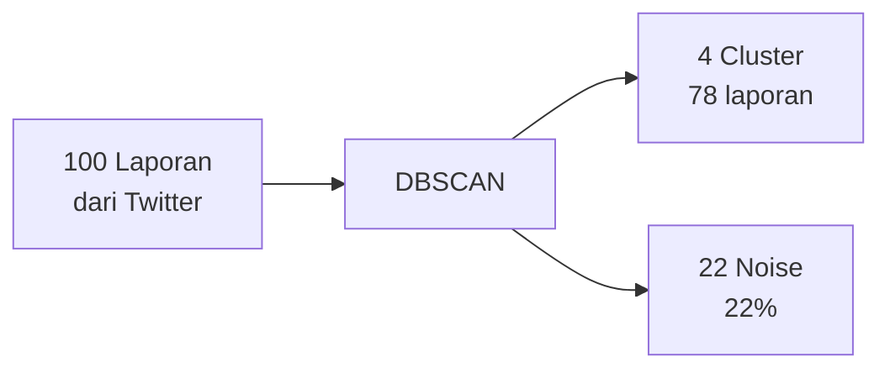

# Hasil Clustering

Hasil clustering dari **laporan Twitter** yang terakumulasi di database. Angka di bawah adalah ilustrasi.

## Sumber Data

```
Twitter API → Twitter Service → MongoDB (issues) → DBSCAN → Dashboard
```

Tidak ada dataset awal — hasil tumbuh seiring laporan masuk.

## Konfigurasi

| Parameter | Nilai | Alasan |
|-----------|-------|--------|
| ε | ~7 km | Satu trip petugas mencakup area ini |
| MinPts | 3 | Minimal 3 laporan untuk jadi cluster |

## Contoh (100 laporan)



| Cluster | Area | Laporan | Tipe Dominan |
|---------|------|---------|-------------|
| C1 | Jakarta Pusat | 31 | garbage, flood |
| C2 | Jakarta Selatan | 24 | vandalism |
| C3 | Bandung | 14 | fallen_tree |
| C4 | Surabaya | 9 | road_damage |

## Moderate Clustering

Tujuannya **sedang** — tidak terlalu banyak cluster kecil, tidak satu cluster raksasa.

| ε | Efek |
|---|------|
| 1 km (terlalu kecil) | Banyak cluster, petugas tetap bolak-balik |
| **~7 km (sedang)** | **Satu trip per area** |
| 50 km (terlalu besar) | Satu cluster raksasa, jarak tempuh jauh |
