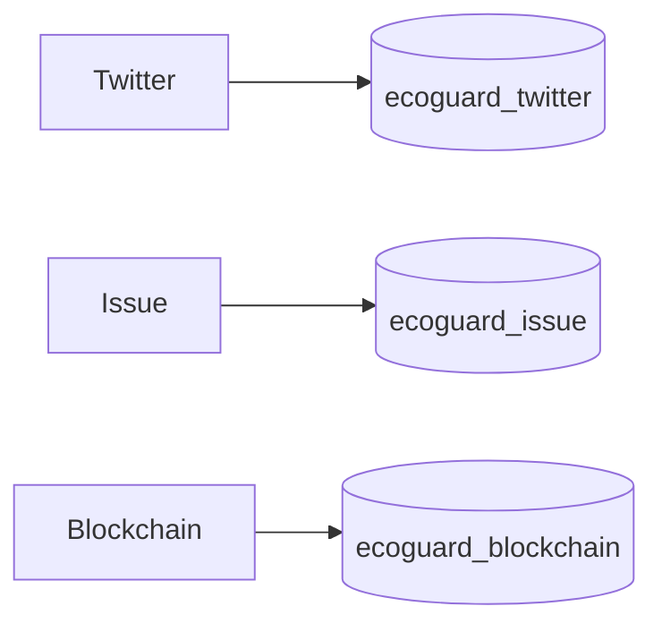

# MongoDB

Document database.

## Flow


```mermaid
flowchart LR
    TW[Twitter] --> DB1[(ecoguard_twitter)]
    IS[Issue] --> DB2[(ecoguard_issue)]
    BC[Blockchain] --> DB3[(ecoguard_blockchain)]
```

```bash
docker compose exec mongodb mongosh
use ecoguard_twitter
db.tweets.find().limit(5)
```
