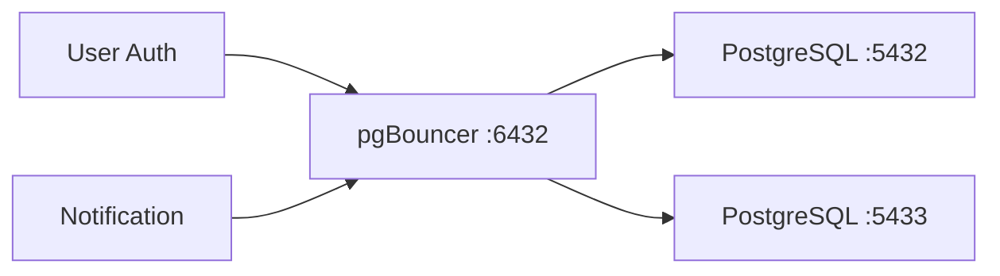

# pgBouncer

Connection pooler untuk PostgreSQL.

```mermaid
graph LR
    UA[User Auth] --> PB[pgBouncer :6432]
    NO[Notification] --> PB
    PB --> PG1[PostgreSQL :5432]
    PB --> PG2[PostgreSQL :5433]
```

Service konek via pgBouncer, bukan langsung ke PostgreSQL.
