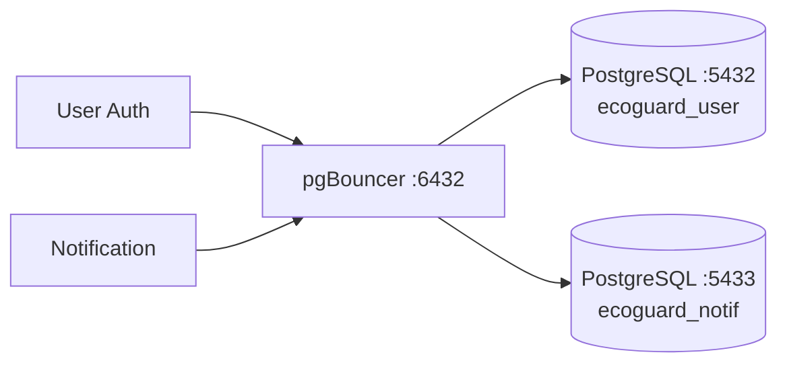

# PostgreSQL

Relational database.

## Flow

| Instance | Port | Database |
|----------|------|----------|
| `postgres-user` | 5432 | `ecoguard_user` |
| `postgres-notif` | 5433 | `ecoguard_notif` |

Service konek via pgBouncer, bukan langsung.
