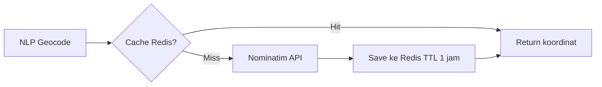

# Redis

In-memory cache untuk NLP.

## Flow

```mermaid
flowchart LR
    NLP[NLP Geocode] --> Cache{Cache Redis?}
    Cache -->|Hit| Return[Return koordinat]
    Cache -->|Miss| API[Nominatim API]
    API --> Save[Save ke Redis TTL 1 jam]
    Save --> Return
```
