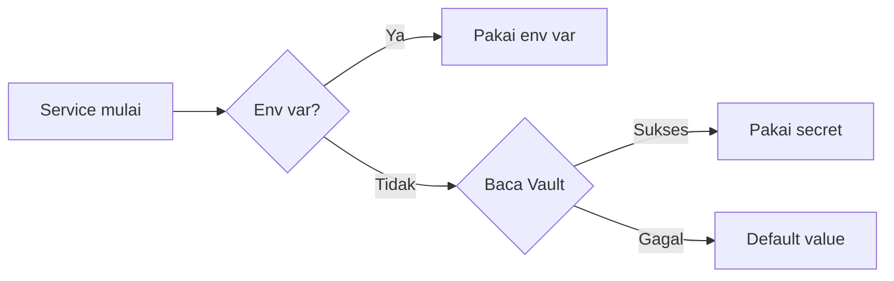

# Vault

HashiCorp Vault untuk secret management.

## Flow



```rust
mongo_uri: env("MONGO_URI")
    .or_else(|| read_secret("ecoguard/db", "mongo-twitter-uri"))
    .unwrap_or("mongodb://localhost:27017")
```

> ⚠️ Dev mode — data hilang saat restart.
