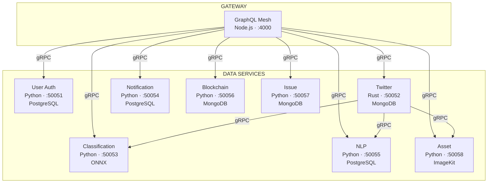
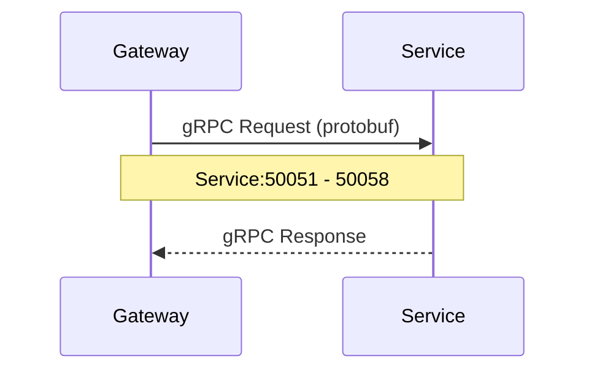
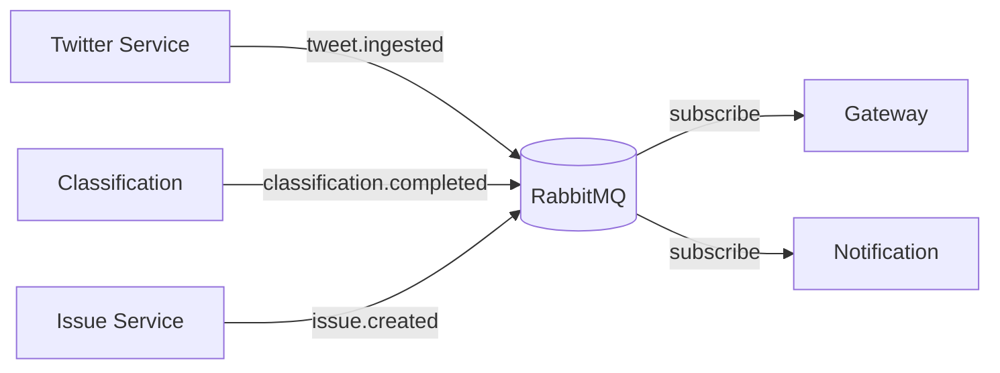
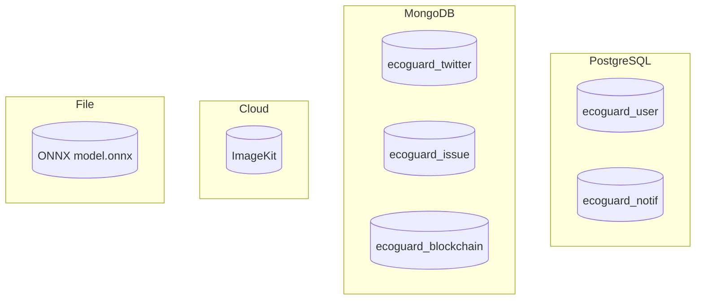

# Service Overview

Ecoguard memiliki **9 backend services** yang saling terhubung via gRPC dan RabbitMQ.

## Architecture Diagram

## Service Matrix

| Service | Bahasa | gRPC Port | HTTP Port | Database | Proto Package |
|---------|--------|-----------|-----------|----------|---------------|
| **Gateway** | Node.js | - | 4000 | - | - |
| **User Auth** | Python | 50051 | - | PostgreSQL | `user` |
| **Twitter** | Rust | 50052 | 8000 | MongoDB | `twitter` |
| **Classification** | Python | 50053 | 8083 | ONNX model | `classification` |
| **Notification** | Python | 50054 | - | PostgreSQL | `notification` |
| **NLP** | Python | 50055 | - | PostgreSQL | `nlp` |
| **Blockchain** | Python | 50056 | - | MongoDB | `blockchain` |
| **Issue** | Python | 50057 | - | MongoDB | `issue` |
| **Asset** | Python | 50058 | 8088 | ImageKit | `asset` |

## Communication Patterns

### gRPC (Sync)
Request-response via protobuf contracts:

### RabbitMQ (Async)
Event bus dengan topic exchange `ecoguard.events`:

### Database Isolation
Tiap service punya database sendiri — **no sharing**:

