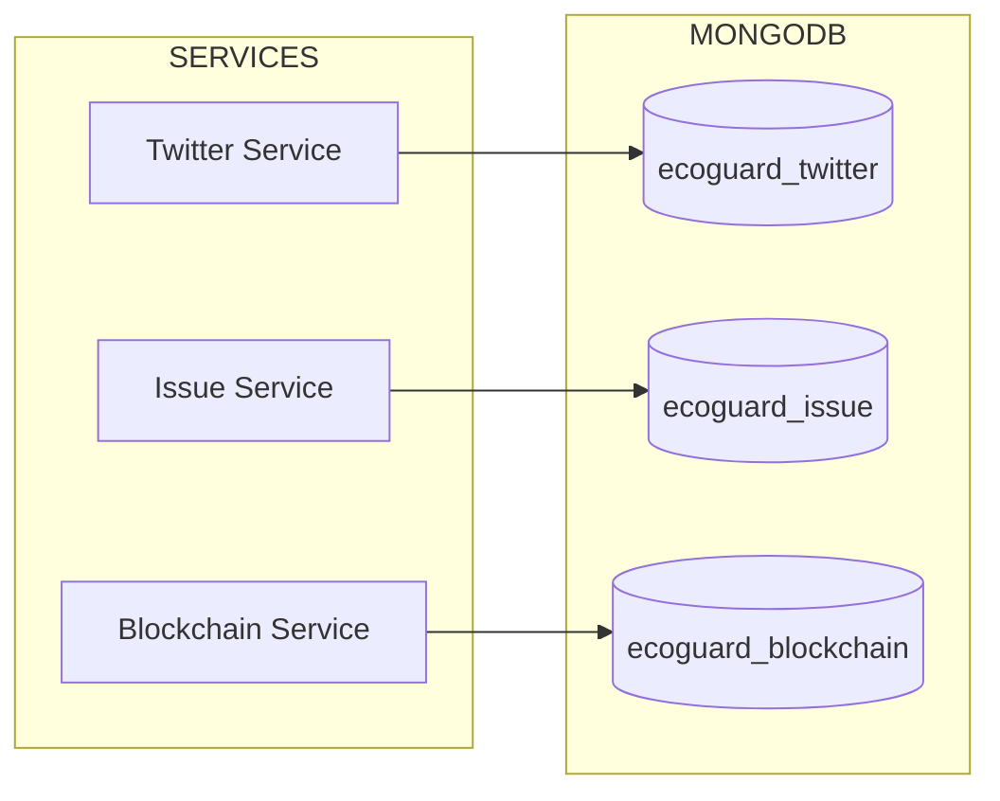

# MongoDB

Document database for Twitter, Issue, and Blockchain services.

## Flow



## Konfigurasi

```yaml
mongodb:
  image: mongo:7
  container_name: ecoguard-mongo
  ports: ["27017:27017"]
  volumes:
    - mongo-data:/data/db
    - ./mongodb/init.js:/docker-entrypoint-initdb.d/init.js
```

## Init Script

```javascript
// infra/mongodb/init.js
db = db.getSiblingDB("ecoguard_twitter");
db.createCollection("tweets");
db.tweets.createIndex({ "tweet_id": 1 });
db.tweets.createIndex({ "created_at": -1 });

db = db.getSiblingDB("ecoguard_issue");
db.createCollection("issues");
db.issues.createIndex({ "status": 1 });
```

## Akses CLI

```bash
docker compose exec mongodb mongosh
use ecoguard_twitter
db.tweets.find().limit(5)
```
