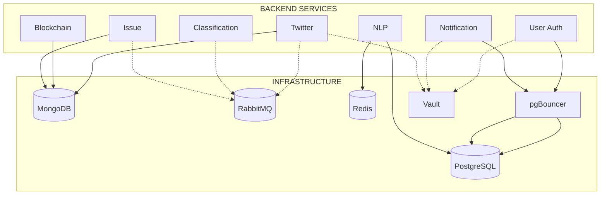

# Infrastructure Overview

Ecoguard uses several supporting infrastructure components to run its backend services.



## Components

| Component | Port | Image | Used By |
|-----------|------|-------|---------|
| [PostgreSQL](/infrastructure/postgresql) | 5432 / 5433 | `postgres:16-alpine` | User Auth, Notification, NLP |
| [pgBouncer](/infrastructure/pgbouncer) | 6432 | `edoburu/pgbouncer` | Connection pooling |
| [MongoDB](/infrastructure/mongodb) | 27017 | `mongo:7` | Twitter, Issue, Blockchain |
| [RabbitMQ](/infrastructure/rabbitmq) | 5672 / 15672 | `rabbitmq:3-management-alpine` | Event bus |
| [Redis](/infrastructure/redis) | 6379 | `redis:7-alpine` | NLP cache |
| [Vault](/infrastructure/vault) | 8200 | `hashicorp/vault:1.18` | Secret management |

## Quick Start

Semua infrastruktur jalan via Docker Compose:

```bash
cd infra
docker compose up -d
```

Cek status:

```bash
docker compose ps
```
