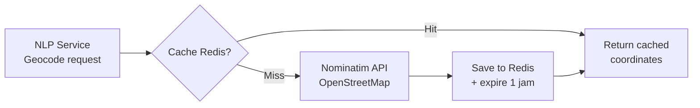

# Redis

In-memory cache for NLP Service.

## Flow Caching



## Konfigurasi

```yaml
redis:
  image: redis:7-alpine
  container_name: ecoguard-redis
  ports: ["6379:6379"]
```

## Penggunaan

```python
# NLP Service — cache geocode results
cache = GeoCache("redis://redis:6379/0")

result = cache.get(address)
if not result:
    result = nominatim.geocode(address)
    cache.set(address, result, ttl=3600)  # cache 1 jam
```

## CLI

```bash
docker compose exec redis redis-cli
KEYS *
GET some-address
```

## Catatan

Redis is currently only used by NLP Service. In the future it can be used for session cache / rate limiting.
