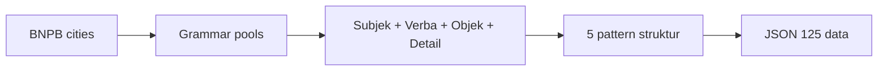

# Scrapers

Generate data laporan lingkungan untuk clustering dari dataset BNPB.

## collections.xlsx

Dataset BNPB Indonesia — 28.773 baris data bencana (banjir, longsor, cuaca ekstrem, dll) dari 512 kota.

Sumber: [Kaggle](https://www.kaggle.com/datasets/maudiana/indonesia-natural-disaster-dataset-bnpb-records)

## Cara Generate

```bash
cd research/scraping
python -m venv venv
venv\Scripts\activate
pip install openpyxl
python app.py
```

## Algorithm

Grammar-based text generation — bukan ML, bukan template. Menggabungkan subjek, verba, objek, dan detail dari pools kata per label:



Output: `data/dataset.json` — 25 laporan per label.
